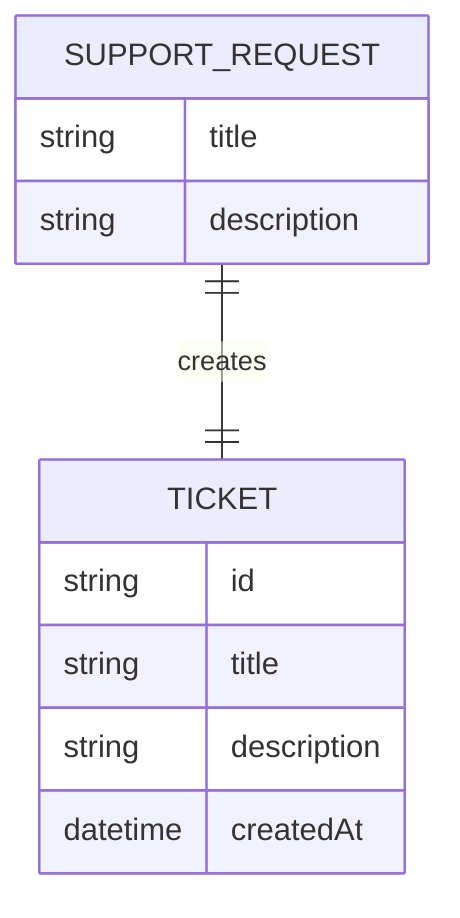

# Data Sketch - Create Ticket

## Prima Di Compilare

Un data sketch e' una classificazione dei campi prima dello schema definitivo.

Serve a decidere quali dati sono accettati, generati, respinti o ancora mancanti.

Il Mermaid finale visualizza solo campi e relazioni gia' motivati nella tabella.

Non usare questo file per progettare tutto il database o accettare campi non collegati a issue e contract.

## Come Scegliere Lo Stato Del Campo

| Stato | Usalo quando | Domanda di controllo |
| --- | --- | --- |
| accettato | il campo arriva dall'input e serve al primo slice | chi lo inserisce? |
| generato | il sistema crea il valore | quando viene creato? |
| respinto | il campo e' fuori scope o non motivato | quale vincolo lo esclude? |
| mancante | il campo potrebbe servire, ma manca una decisione | chi deve chiarirlo? |

Se non sai motivare un campo, non metterlo nel Mermaid: lascialo `mancante` o `respinto`.

## Scopo

Classificare i dati prima di chiedere codice.

## Campi

| Campo | Stato | Motivo | Fonte |
| --- | --- | --- | --- |
| `title` | accettato | È una delle informazioni minime richieste per creare il ticket | issue |
| `description` | accettato | È una delle informazioni minime richieste per creare il ticket | issue |
| `customer` | mancante | Potrebbe servire per collegare il ticket a un cliente, ma non è stato chiarito in questo slice | inferenza |
| `priority` | mancante | Potrebbe servire per evidenziare i ticket più importanti, ma non è stata ancora presa una decisione su questo campo | inferenza |
| `area` | mancante | Potrebbe servire per classificare i ticket, ma non è stato chiarito in questo slice | inferenza |
| `status` | mancante | Potrebbe servire per capire lo stato del ticket, ma non è stato definito nel contratto minimo | inferenza |
| `id` | generato | Serve a identificare il ticket creato | contract |
| `attachments` | respinto | Gli allegati al ticket sono esplicitamente fuori scope | issue |
| `createdAt` | generato | Serve a indicare quando il ticket viene creato | contract |

## Mermaid Leggero

Usa Mermaid solo per visualizzare la relazione minima. Non trasformarlo in schema DB definitivo.

## Campi mostrati nel diagramma

- `title` - accettato
- `description` - accettato
- `id` - generato
- `createdAt` - generato

## Campi Scartati O Rimandati

| Campo | Decisione | Motivo |
| --- | --- | --- |
| `customer` | rimandato | Potrebbe servire per collegare il ticket a un cliente, ma non è stato chiarito in questo slice |
| `priority` | rimandato | Potrebbe servire per evidenziare i ticket più importanti, ma non è stata ancora presa una decisione su questo campo |
| `area` | rimandato | Potrebbe servire per classificare i ticket, ma non è stato chiarito in questo slice |
| `status` | rimandato | Potrebbe servire per capire lo stato del ticket, ma non è stato definito nel contratto minimo |
| `attachments` | respinto | Gli allegati al ticket sono fuori scope |

## Domande Per L07

- In quale file viene gestita la creazione dei ticket?
- Quale naming viene usato nella repo per i campi `title`, `description`, `id` e `createdAt`?
- I campi `customer`, `priority`, `area` o `status` devono rientrare nel primo slice oppure restano fuori?
